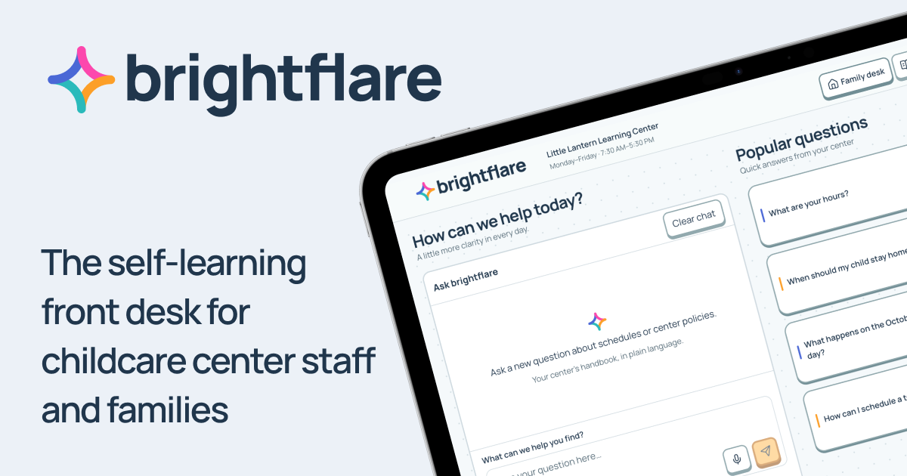

<p align="left">
  
</p>

<p align="left">
  
</p>

**A calmer front desk for childcare families.** I designed brightflare for parents using the center’s shared iPad and staff maintaining trusted answers. At the front desk, the first screen keeps common questions in view without unnecessary scrolling; parents can open approved FAQs or ask something new, then clear the session for the next family. Staff see public question trends and gaps, improve approved guidance, and choose which answers to feature.

**Try it:** [Family front desk](https://brightflare.sprioleau.dev/) · [Family handbook](https://brightflare.sprioleau.dev/handbook) · [Staff workspace](https://brightflare.sprioleau.dev/admin)

> brightflare is a fictional take-home prototype. Little Lantern Learning Center, its policies, staff, children, and family records are invented for demonstration. It does not connect to Brightwheel or contain real family information.

**Project notes:** [Build decisions](docs/build-decisions.md) · [Functionality audit](docs/functionality-audit.md) · [GitHub repository](https://github.com/sprioleau/brightflare)

## See it

### Family desk


<p align="left">
  
  
</p>

### Staff workspace


### Family handbook


These captures show the current app. Any standalone HTML style explorations are design proposals and are not part of the live interface.

## How it helps

- **Families get a useful first answer.** Approved common questions are available on the shared iPad without an AI call. New questions and follow-ups stay together in a conversation. Supported answers link to a handbook or staff-approved source and show its review date; Clear chat starts a fresh session for the next family.
- **The app says when it does not know.** Missing, unclear, or sensitive policy questions go to staff instead of being guessed or shown with an unsupported source. Dated center updates can clarify a general handbook policy for a specific period, while future and expired records stay out of current guidance.
- **The handbook works on a phone.** Families can browse published sections, open direct links, and follow a source citation from an answer to the relevant section. Staff can search handbook records in Admin, and the answer service can search approved records when grounding a reply.
- **Staff see what needs attention.** Admin automatically groups public questions into trends and surfaces unanswered policy gaps or stale guidance. Counts represent question events and anonymous sessions, not identified families.
- **Staff keep control of policy.** Staff can answer recurring questions and edit or approve handbook content; the assistant never changes policy on its own. Staff-approved answers can become candidates for featured home FAQs, and staff choose featured questions, announcements, and center details.
- **Private child questions stay private.** The shared desk directs unverified child-specific questions to staff. The backend also supports verified access to fictional family records, excludes private wording from public topic analytics, and clears private responses after a short period or when the tab is hidden.

## The prototype

The parent desk is designed for the center’s shared landscape iPad and adapts to phones, which scroll naturally on smaller screens. Parents can see the question form, center hours, and featured questions together. Staff use the workspace to review questions, maintain approved answers, and manage featured content, announcements, and center details.

The source of truth is center-approved guidance: handbook entries, dated center updates, and staff-published answers. Final supported answers link to retrieved records and show their review dates; the server checks citations before presenting an answer as verified. Eligible routine answers may first stream as clearly labeled drafts without source links. The verified answer replaces the draft only after citation checks pass; sensitive questions and staff handoffs never stream draft answer text. Requests have an eight-second deadline, with progress messages and a retry or staff handoff if the service cannot respond in time.

I drew visual inspiration from my earlier projects [teeny.fun](https://teeny.fun/), with its playful neubrutalist depth, and [2cents.dev](https://2cents.dev/), with its moving-dot background. I adapted those ideas with amber actions, calm reading surfaces, clear source labels, and motion that can be paused for a trustworthy childcare setting.

## Demo access

Gemini inference uses free-tier accounts and may be rate-limited. OpenRouter fallback is implemented but remains inactive by default while a reliable model for both parent answers and staff assistance is being verified.

- Staff workspace: open [Admin](https://brightflare.sprioleau.dev/admin). The demo center PIN **2468** is visible and prefilled; press Enter or Continue.
- Family verification API demo: PIN **1357** is configured for the fictional child **Mia Carter**. The shared family desk has no PIN entry screen; parents can browse FAQs and ask general questions without signing in. Child-specific questions at the shared desk are directed to staff.

Demo credentials are not a production authentication scheme. Credentials are configured outside this repository.

## Run locally

Use Node.js 22+ and pnpm. Configure `NEXT_PUBLIC_CONVEX_URL`, `BRIGHTFLARE_SERVER_SECRET`, `BRIGHTFLARE_SESSION_SECRET`, `BRIGHTFLARE_ADMIN_PIN`, and `BRIGHTFLARE_FAMILY_PIN` in `.env.local`. For direct Gemini inference, also set `GOOGLE_GENERATIVE_AI_API_KEY`; Vercel AI Gateway credentials can be used instead. The default model is `gemini-3.5-flash-lite` and can be changed with `GEMINI_MODEL_ID`. Following the working Flock configuration, `gemini-3.6-flash` falls back to `gemini-3.5-flash-lite`; configured Flash-Lite can fall back to `gemini-3.5-flash`. To opt in after selecting a verified model, set `OPENROUTER_FALLBACK_ENABLED=true`, `OPENROUTER_API_KEY`, and an explicit `OPENROUTER_MODEL_ID` that has been verified for the required structured output and tools. It runs only after Gemini and its existing alternate fail from capacity, quota, or the bounded attempt timeout. Parent answers reserve time within the original eight-second deadline, then validate structured output and approved-source citations as usual. Parent answers use minimal thinking and the supplied approved source text before using source tools.

```bash
pnpm install
pnpm dev
pnpm test
pnpm typecheck
pnpm build
```

Convex functions and the fictional Little Lantern fixture are in `convex/`. The initial seed creates the center only when it is absent; an additive demo update uses stable fixture keys and preserves existing handbook edits. `CHANGELOG.md` records shipped feature increments.
